# 🚀 JavaScript Developer Handbook - From Zero to Hero

<div align="center">


**A comprehensive, structured guide to master JavaScript from fundamentals to advanced concepts**

[📚 Start Learning](#-learning-path) • [🎯 Roadmap](#-interactive-roadmap) • [💡 Resources](#-additional-resources) • [🤝 Contribute](#-contributing)

</div>

---

## 📖 About This Handbook

This handbook is designed as a **progressive learning path** for JavaScript developers at all levels. Whether you're a complete beginner or looking to master advanced concepts, this guide provides:

✨ **Structured Learning** - Topics organized from basic to advanced  
🎯 **Hands-on Examples** - Practical code snippets for every concept  
📊 **Visual Roadmap** - Clear progression path  
🔄 **Regular Updates** - Keeping up with modern JavaScript  

---

## 🗺️ Interactive Roadmap

```mermaid
graph TD
    A[🎯 Start Here] --> B[Phase 1: Foundations]
    B --> C[Phase 2: Core Concepts]
    C --> D[Phase 3: Intermediate]
    D --> E[Phase 4: Advanced]
    E --> F[Phase 5: Expert]
    F --> G[Phase 6: Mastery]
    
    B --> B1[JavaScript Basics]
    B --> B2[Data Types & Variables]
    B --> B3[Operators & Control Flow]
    
    C --> C1[Functions & Scope]
    C --> C2[Objects & Arrays]
    C --> C3[DOM Manipulation]
    
    D --> D1[Async JavaScript]
    D --> D2[ES6+ Features]
    D --> D3[Error Handling]
    
    E --> E1[OOP & Prototypes]
    E --> E2[Functional Programming]
    E --> E3[Design Patterns]
    
    F --> F1[Performance Optimization]
    F --> F2[Testing & Debugging]
    F --> F3[Security Best Practices]
    
    G --> G1[Architecture Patterns]
    G --> G2[Frameworks & Libraries]
    G --> G3[Real-world Projects]
    
    style A fill:#ff6b6b
    style B fill:#4ecdc4
    style C fill:#45b7d1
    style D fill:#96ceb4
    style E fill:#ffeaa7
    style F fill:#dfe6e9
    style G fill:#a29bfe
```



---

## 📚 Learning Path

### 🌱 Phase 1: Foundations (Weeks 1-2)

<details>
<summary><b>📂 01 - Introduction to JavaScript</b></summary>

- **What is JavaScript?**
  - History and evolution
  - JavaScript vs ECMAScript
  - Browser vs Node.js environments
- **Setting Up Development Environment**
  - Code editors (VS Code, WebStorm)
  - Browser DevTools
  - Node.js installation
- **Your First Program**
  - Hello World
  - Running JavaScript in different environments
  - Console methods

📁 [View Code Examples →](./01-introduction)

</details>

<details>
<summary><b>📂 02 - Variables and Data Types</b></summary>

- **Variable Declarations**
  - `var`, `let`, and `const`
  - Hoisting behavior
  - Block scope vs function scope
- **Primitive Data Types**
  - String, Number, Boolean
  - Undefined, Null
  - Symbol, BigInt
- **Type Conversion & Coercion**
  - Explicit conversion
  - Implicit coercion
  - Truthy and falsy values

📁 [View Code Examples →](./02-variables-datatypes)

</details>

<details>
<summary><b>📂 03 - Operators and Expressions</b></summary>

- **Arithmetic Operators** (`+`, `-`, `*`, `/`, `%`, `**`)
- **Comparison Operators** (`==`, `===`, `!=`, `!==`, `>`, `<`)
- **Logical Operators** (`&&`, `||`, `!`)
- **Assignment Operators** (`=`, `+=`, `-=`, etc.)
- **Ternary Operator** (`? :`)
- **Operator Precedence**

📁 [View Code Examples →](./03-operators)

</details>

<details>
<summary><b>📂 04 - Control Flow</b></summary>

- **Conditional Statements**
  - if, else if, else
  - switch statements
  - Nested conditions
- **Loops**
  - for loop
  - while and do-while
  - for...in and for...of
  - break and continue

📁 [View Code Examples →](./04-control-flow)

</details>

---

### 🌿 Phase 2: Core Concepts (Weeks 3-4)

<details>
<summary><b>📂 05 - Functions</b></summary>

- **Function Basics**
  - Function declarations
  - Function expressions
  - Arrow functions
  - Function parameters and arguments
- **Advanced Function Concepts**
  - Default parameters
  - Rest parameters
  - Spread operator
  - Higher-order functions
  - Callbacks
  - IIFE (Immediately Invoked Function Expressions)

📁 [View Code Examples →](./05-functions)

</details>

<details>
<summary><b>📂 06 - Execution Context and Call Stack</b></summary>

- **Execution Context**
  - Global Execution Context (GEC)
  - Function Execution Context (FEC)
  - Eval Execution Context
- **Execution Phases**
  - Memory Creation Phase (Variable Environment)
  - Code Execution Phase (Thread of Execution)
- **Call Stack**
  - How JavaScript executes code
  - Stack frames
  - Stack overflow
  - Visualizing execution flow
- **Hoisting**
  - Variable hoisting
  - Function hoisting
  - Temporal Dead Zone (TDZ)

📁 [View Code Examples →](./06-execution-context)

</details>

<details>
<summary><b>📂 07 - Scope and Closures</b></summary>

- **Scope Types**
  - Global scope
  - Function scope
  - Block scope
  - Lexical scope
  - Scope chain
- **Closures**
  - Understanding closures
  - Practical uses
  - Common pitfalls
  - Memory considerations
  - Closures and loops

📁 [View Code Examples →](./07-scope-closures)

</details>

<details>
<summary><b>📂 08 - Arrays</b></summary>

- **Array Fundamentals**
  - Creating arrays
  - Accessing elements
  - Array properties
- **Array Methods**
  - Mutating: `push`, `pop`, `shift`, `unshift`, `splice`
  - Non-mutating: `slice`, `concat`
  - Iteration: `forEach`, `map`, `filter`, `reduce`
  - Search: `find`, `findIndex`, `indexOf`, `includes`
  - Sorting: `sort`, `reverse`
- **Advanced Array Techniques**
  - Multi-dimensional arrays
  - Array destructuring
  - Spread and rest with arrays

📁 [View Code Examples →](./08-arrays)

</details>

<details>
<summary><b>📂 09 - Objects</b></summary>

- **Object Fundamentals**
  - Object literals
  - Properties and methods
  - Accessing properties
  - this keyword
- **Advanced Object Concepts**
  - Object destructuring
  - Computed properties
  - Object methods: `Object.keys()`, `Object.values()`, `Object.entries()`
  - Object spread operator
  - Optional chaining (`?.`)
  - Nullish coalescing (`??`)

📁 [View Code Examples →](./09-objects)

</details>

<details>
<summary><b>📂 10 - Strings and Template Literals</b></summary>

- **String Methods**
  - `charAt`, `slice`, `substring`, `substr`
  - `toUpperCase`, `toLowerCase`
  - `trim`, `split`, `join`
  - `replace`, `replaceAll`
  - `indexOf`, `includes`, `startsWith`, `endsWith`
- **Template Literals**
  - String interpolation
  - Multi-line strings
  - Tagged templates
- **Regular Expressions**
  - Pattern matching
  - String validation

📁 [View Code Examples →](./10-strings)

</details>

---

### 🌳 Phase 3: Intermediate (Weeks 5-7)

<details>
<summary><b>📂 11 - DOM Manipulation</b></summary>

- **DOM Basics**
  - Understanding the DOM tree
  - Selecting elements (`getElementById`, `querySelector`, etc.)
  - Creating and removing elements
  - Modifying attributes and classes
- **Event Handling**
  - Event listeners
  - Event propagation (bubbling and capturing)
  - Event delegation
  - Common events (click, submit, input, etc.)
- **DOM Traversal**
  - Parent, child, and sibling navigation
  - `closest`, `matches`

📁 [View Code Examples →](./10-dom-manipulation)

</details>

<details>
<summary><b>📂 11 - Browser APIs</b></summary>

- **Storage APIs**
  - localStorage
  - sessionStorage
  - Cookies
- **Fetch API**
  - Making HTTP requests
  - Handling responses
  - Error handling
- **Other Important APIs**
  - Geolocation API
  - Web Workers
  - Intersection Observer
  - Notification API

📁 [View Code Examples →](./11-browser-apis)

</details>

<details>
<summary><b>📂 12 - Asynchronous JavaScript</b></summary>

- **Callback Pattern**
  - Understanding callbacks
  - Callback hell
- **Promises**
  - Creating promises
  - Promise chaining
  - `Promise.all`, `Promise.race`, `Promise.allSettled`
  - Error handling with `.catch()`
- **Async/Await**
  - Async functions
  - Await keyword
  - Error handling with try-catch
  - Parallel vs sequential execution

📁 [View Code Examples →](./12-async-javascript)

</details>

<details>
<summary><b>📂 13 - Error Handling</b></summary>

- **Try-Catch-Finally**
  - Basic error handling
  - Throwing custom errors
- **Error Types**
  - SyntaxError, ReferenceError, TypeError
  - Custom error classes
- **Best Practices**
  - Graceful error handling
  - Error logging
  - User-friendly error messages

📁 [View Code Examples →](./13-error-handling)

</details>

<details>
<summary><b>📂 14 - ES6+ Modern Features</b></summary>

- **Destructuring**
  - Array destructuring
  - Object destructuring
  - Nested destructuring
- **Spread and Rest Operators**
- **Modules**
  - Import and export
  - Named vs default exports
  - Dynamic imports
- **Enhanced Object Literals**
- **Iterators and Generators**
- **Maps and Sets**
  - Map vs Object
  - WeakMap and WeakSet
- **Symbols**

📁 [View Code Examples →](./14-es6-features)

</details>

---

### 🌲 Phase 4: Advanced (Weeks 8-10)

<details>
<summary><b>📂 15 - Object-Oriented Programming</b></summary>

- **Classes**
  - Class syntax
  - Constructors
  - Methods and properties
  - Static methods
- **Inheritance**
  - Extends keyword
  - Super keyword
  - Method overriding
- **Encapsulation**
  - Private fields (#)
  - Getters and setters
- **Polymorphism**

📁 [View Code Examples →](./15-oop)

</details>

<details>
<summary><b>📂 16 - Prototypes and Inheritance</b></summary>

- **Prototype Chain**
  - Understanding `__proto__`
  - `prototype` property
  - Object.create()
- **Prototypal Inheritance**
  - Constructor functions
  - Prototype methods
  - Inheritance patterns
- **Classes vs Prototypes**

📁 [View Code Examples →](./16-prototypes)

</details>

<details>
<summary><b>📂 17 - Functional Programming</b></summary>

- **Core Concepts**
  - Pure functions
  - Immutability
  - Side effects
  - Function composition
- **Advanced Techniques**
  - Currying
  - Partial application
  - Memoization
  - Recursion
- **Functional Array Methods**
  - map, filter, reduce
  - flatMap, flat
  - Custom implementations

📁 [View Code Examples →](./17-functional-programming)

</details>

<details>
<summary><b>📂 18 - Design Patterns</b></summary>

- **Creational Patterns**
  - Singleton
  - Factory
  - Constructor
- **Structural Patterns**
  - Module pattern
  - Revealing module pattern
  - Decorator
  - Proxy
- **Behavioral Patterns**
  - Observer
  - Pub/Sub
  - Strategy
  - Command

📁 [View Code Examples →](./18-design-patterns)

</details>

<details>
<summary><b>📂 19 - Memory Management</b></summary>

- **Memory Lifecycle**
  - Allocation
  - Usage
  - Garbage collection
- **Memory Leaks**
  - Common causes
  - Detection techniques
  - Prevention strategies
- **Performance Optimization**
  - Reference management
  - Event listener cleanup

📁 [View Code Examples →](./19-memory-management)

</details>

---

### 🏔️ Phase 5: Expert (Weeks 11-13)

<details>
<summary><b>📂 20 - Advanced Async Patterns</b></summary>

- **Concurrent Programming**
  - Promise combinators
  - Async iteration
  - AsyncIterator and AsyncGenerator
- **Web Workers**
  - Dedicated workers
  - Shared workers
  - Service workers basics
- **Real-time Communication**
  - WebSockets
  - Server-Sent Events (SSE)

📁 [View Code Examples →](./20-advanced-async)

</details>

<details>
<summary><b>📂 21 - Performance Optimization</b></summary>

- **Code Optimization**
  - Debouncing and throttling
  - Lazy loading
  - Code splitting
  - Tree shaking
- **Rendering Performance**
  - Virtual DOM concepts
  - RequestAnimationFrame
  - Intersection Observer
- **Measurement and Profiling**
  - Performance API
  - Chrome DevTools profiling
  - Lighthouse

📁 [View Code Examples →](./21-performance)

</details>

<details>
<summary><b>📂 22 - Testing</b></summary>

- **Testing Fundamentals**
  - Unit testing
  - Integration testing
  - E2E testing
- **Testing Tools**
  - Jest basics
  - Testing Library
  - Mocking and spying
- **Test-Driven Development (TDD)**
  - Red-Green-Refactor cycle
  - Writing testable code

📁 [View Code Examples →](./22-testing)

</details>

<details>
<summary><b>📂 23 - Security Best Practices</b></summary>

- **Common Vulnerabilities**
  - XSS (Cross-Site Scripting)
  - CSRF (Cross-Site Request Forgery)
  - Injection attacks
- **Security Measures**
  - Input validation and sanitization
  - Content Security Policy (CSP)
  - HTTPS and secure cookies
- **Authentication & Authorization**
  - JWT tokens
  - OAuth basics
  - Secure storage practices

📁 [View Code Examples →](./23-security)

</details>

<details>
<summary><b>📂 24 - Build Tools and Module Bundlers</b></summary>

- **Module Bundlers**
  - Webpack basics
  - Rollup
  - Vite
  - esbuild
- **Task Runners**
  - npm scripts
  - Build optimization
- **Transpilers**
  - Babel configuration
  - TypeScript basics

📁 [View Code Examples →](./24-build-tools)

</details>

---

### 🎓 Phase 6: Mastery (Weeks 14+)

<details>
<summary><b>📂 25 - Frameworks Overview</b></summary>

- **React Fundamentals**
  - Components and props
  - State and lifecycle
  - Hooks
- **Vue.js Basics**
  - Reactive data
  - Components
  - Directives
- **Other Frameworks**
  - Angular overview
  - Svelte introduction
  - Framework comparison

📁 [View Code Examples →](./25-frameworks)

</details>

<details>
<summary><b>📂 26 - Node.js Fundamentals</b></summary>

- **Node.js Basics**
  - Event loop
  - Modules system
  - File system operations
- **HTTP and Express**
  - Creating servers
  - Routing
  - Middleware
- **Databases**
  - MongoDB basics
  - SQL databases
  - ORMs (Sequelize, Mongoose)

📁 [View Code Examples →](./26-nodejs)

</details>

<details>
<summary><b>📂 27 - Advanced Patterns and Architecture</b></summary>

- **Architectural Patterns**
  - MVC, MVP, MVVM
  - Clean Architecture
  - Hexagonal Architecture
- **State Management**
  - Redux patterns
  - MobX
  - Context API patterns
- **Microservices Basics**
  - API design
  - GraphQL introduction

📁 [View Code Examples →](./27-architecture)

</details>

<details>
<summary><b>📂 28 - Real-World Projects</b></summary>

- **Project 1: Task Management App**
  - CRUD operations
  - Local storage
  - DOM manipulation
- **Project 2: Weather Dashboard**
  - API integration
  - Async handling
  - Error management
- **Project 3: E-commerce Cart**
  - State management
  - Complex UI interactions
  - Form validation
- **Project 4: Real-time Chat**
  - WebSocket implementation
  - Authentication
  - Database integration

📁 [View Code Examples →](./28-projects)

</details>

---

## 🎯 Learning Tracks

Choose your learning path based on your goals:

### 🎨 Frontend Developer Track
```
Foundations → DOM Manipulation → Async JS → ES6+ → React/Vue → Projects
```

### ⚙️ Backend Developer Track
```
Foundations → Functions → Async JS → Node.js → Databases → API Design
```

### 🚀 Full-Stack Developer Track
```
Complete all phases + Framework deep-dive + Node.js mastery
```

---

## 💡 Additional Resources

### 📺 Recommended Learning Platforms
- [MDN Web Docs](https://developer.mozilla.org/en-US/docs/Web/JavaScript)
- [JavaScript.info](https://javascript.info/)
- [FreeCodeCamp](https://www.freecodecamp.org/)
- [Eloquent JavaScript](https://eloquentjavascript.net/)

### 🛠️ Useful Tools
- **Code Editors**: VS Code, WebStorm, Sublime Text
- **Browser DevTools**: Chrome DevTools, Firefox Developer Tools
- **Online Playgrounds**: CodePen, JSFiddle, CodeSandbox
- **Package Managers**: npm, yarn, pnpm

### 📱 Practice Platforms
- [LeetCode](https://leetcode.com/) - Algorithm practice
- [Codewars](https://www.codewars.com/) - Kata challenges
- [HackerRank](https://www.hackerrank.com/) - Coding challenges
- [Exercism](https://exercism.org/) - Mentored practice

---

## 🤝 Contributing

We welcome contributions! Here's how you can help:

1. **Fork** the repository
2. **Create** a feature branch (`git checkout -b feature/AmazingFeature`)
3. **Commit** your changes (`git commit -m 'Add some AmazingFeature'`)
4. **Push** to the branch (`git push origin feature/AmazingFeature`)
5. **Open** a Pull Request

---

## 💬 Learning Tips & Best Practices

### 🎯 How to Use This Handbook Effectively

**For Beginners:**
- Don't skip topics - each builds on the previous
- Code along with every example
- Build small projects after each phase
- Join JavaScript communities for support

**For Intermediate Developers:**
- Focus on areas you're weak in
- Challenge yourself with the projects
- Contribute back with your own examples
- Teach others what you've learned

**For Advanced Developers:**
- Use as a reference guide
- Deep dive into the advanced sections
- Explore the "why" behind each concept
- Mentor others in their journey

### ⚡ Pro Tips

```javascript
// 1. Practice Daily - Even 30 minutes counts
const consistency = betterThan => 'occasional marathons';

// 2. Build Projects - Theory without practice is incomplete
if (learned_something_new) {
  buildProject();
}

// 3. Read Others' Code - Learn from the community
const growth = readingCode + writingCode;

// 4. Debug Mindfully - Errors are learning opportunities
try {
  embraceMistakes();
} catch (error) {
  learnFromIt(error);
}
```

---

## 🎓 Recommended Learning Path

### Week-by-Week Study Plan

| Week | Focus Area | Practice Project |
|------|------------|------------------|
| 1-2 | Foundations | Calculator App |
| 3-4 | Core Concepts | Todo List |
| 5-7 | Intermediate | Weather App |
| 8-10 | Advanced | E-commerce Cart |
| 11-13 | Expert | Social Media Dashboard |
| 14+ | Mastery | Full-Stack Application |

---

## 📚 Curated Resources by Level

### 📗 Beginner Resources
- [MDN JavaScript Guide](https://developer.mozilla.org/en-US/docs/Web/JavaScript/Guide)
- [JavaScript.info](https://javascript.info/)
- [freeCodeCamp JavaScript Course](https://www.freecodecamp.org/)

### 📘 Intermediate Resources
- [You Don't Know JS (Book Series)](https://github.com/getify/You-Dont-Know-JS)
- [Eloquent JavaScript](https://eloquentjavascript.net/)
- [JavaScript Design Patterns](https://www.patterns.dev/)

### 📕 Advanced Resources
- [ECMAScript Specifications](https://tc39.es/ecma262/)
- [V8 Engine Blog](https://v8.dev/blog)
- [JavaScript Weekly Newsletter](https://javascriptweekly.com/)

---

## 📜 License

This project is licensed under the MIT License - see the [LICENSE](LICENSE) file for details.

---

## ⭐ Show Your Support

If this handbook helped you on your JavaScript journey:

- Give it a ⭐ on GitHub
- Share it with fellow developers
- Tweet about it using #JSDevHandbook
- Consider sponsoring to keep it updated

---

<div align="center">

### 🚀 "The only way to learn a new programming language is by writing programs in it." - Dennis Ritchie

---

**Keep Coding, Keep Learning, Keep Growing!** 💪

---

### Quick Links
[📚 Start Learning](#-learning-path) • [🗺️ Roadmap](#-interactive-roadmap) • [💡 Resources](#-additional-resources) • [🤝 Contribute](#-contributing)

---

[⬆️ Back to Top](#-javascript-developer-handbook---from-zero-to-hero)

---

**Last Updated:** January 2026 | **Maintained by:** JavaScript Developers Worldwide 🌏

</div>